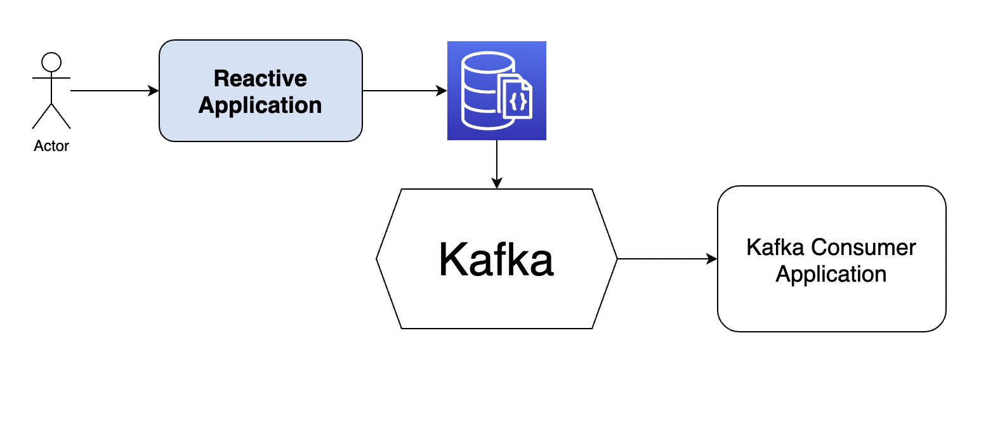

# spring-boot-mongodb-kafka
## Simple architecture

POSTING a song API

```bash
curl --location --request POST 'http://localhost:8080/songs/' \
--header 'Content-Type: application/json' \
--data-raw '{"name":"Love Yourself",
"singer":"Justin biefber"
}'
```
When user create an song service through above API, the data will save into MongoDB. The ksql connector will listen the topic then sending to kafka topic.

Upon kafka topic message sent, consumer will consume the topic then process the message data.
